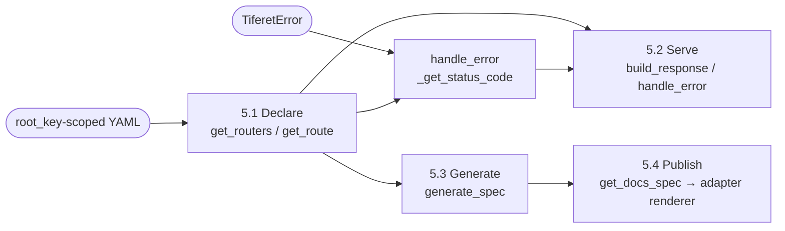

**Status:** Current · **Domain:** `tiferet-openapi` · **Code:** `tiferet_openapi/` · **Branch:** `main` · **Version:** `1.0.0` · **Freeze:** `TOA1-FREEZE-001`
**Companion:** `docs/domain-vision.md`

# tiferet-openapi: Core Domain Distillation

## 1. Purpose of this document
The vision statement says what tiferet-openapi is for: describing an API's shape once and deriving everything else — the running service, the published specification, the documentation — from that one declaration. This document says how the domain actually does that today: its vocabulary, its bounded steps, which of those steps already deliver on the vision and which remain a designed handoff, and the relationships between the pieces. It is the conceptual reference a later RFP or TRD should be measured against. Where a technical term is unavoidable, it is defined once in Section 3 and used consistently after that.

## 2. The core domain, restated precisely
tiferet-openapi's core domain is **turning a single declared description of an API's routes, request/response shapes, and error mappings into everything a client and an operator need from that API, without a second, hand-maintained copy of the same facts.**

The domain has one fixed shape, restated precisely from the vision's own pipeline:

> **Declare** (routes, shapes, and error mappings as YAML) → **Serve** (build a request against the declaration and resolve the right status code) → **Generate** (derive an OpenAPI specification from the same declaration) → **Publish** (hand that specification to a client-facing documentation surface)

and three axes of variation:

1. **Framework adapter** — which web framework (Flask, FastAPI, or a future adapter) is actually receiving HTTP requests and rendering documentation. This domain is deliberately indifferent to this axis at Declare and Generate; it is the reason the Serve and Publish steps exist as named extension points rather than concrete framework code.
2. **YAML `root_key`** — which top-level key in the configuration file holds the declaration (`openapi`, `flask`, or `fast`). This axis is resolved once, at Declare, and is invisible to every later step.
3. **Declared-vs-consumed parity** — whether a field a route declares is actually read by the step that would use it. This was the historical gap between what `ApiRoute` can say and what `generate_spec` did with it. **v1.0.0 closed it:** Generate now consumes `summary`, `description`, `tags`, `request_model`, and `response_model`; a broken model path raises instead of vanishing; `tags` round-trip through YAML write (Section 5.3, Section 8). It remains named here so later work does not reopen a closed seam.

## 3. Ubiquitous language
**`ApiRoute`** — a domain object naming one route: `id`, `endpoint`, `path`, `methods`, `status_code`, and the documentation fields `summary`, `description`, `tags`, `request_model`, and `response_model`.

**`ApiRouter`** — a domain object grouping `ApiRoute` entries under a `name` and an optional URL `prefix`.

**Endpoint** — the fully-qualified, dotted identifier of a route, `router_name.route_id`, used everywhere a route must be named unambiguously (event parameters, `operationId` in the generated spec, request feature IDs).

**`OpenApiService`** — the abstract contract (`get_routers`, `get_route`, `get_status_code`) that any configuration backend must satisfy to supply this domain with routers, a single route, and an error-to-status mapping.

**`OpenApiYamlRepository`** — the sole concrete `OpenApiService` today: a YAML-backed reader parameterized by `root_key` (Section 2, axis 2) so the same code reads a unified `openapi.yml`, or the legacy `flask.yml`/`fast.yml` shapes. It loads through `Yaml` from `tiferet.utils` (`tiferet>=2.0.3`).

**Domain events** — `GetRouters`, `GetRoute` (parses an endpoint into `router_name`/`route_id` and raises `OPENAPI_ROUTE_NOT_FOUND` if the route does not resolve), and `GetStatusCode`. Each wraps one `OpenApiService` method as an injectable, testable unit.

**Aggregate / TransferObject pair** — this domain's mappers come in two per model. `ApiRouteAggregate`/`ApiRouterAggregate` extend the domain object plus Tiferet's `Aggregate` for in-memory mutation (`add_route`, `remove_route`). `ApiRouteYamlObject`/`ApiRouterYamlObject` extend the domain object plus `TransferObject` for YAML round-tripping, using a `_ROLES` dict to control which fields serialize under which role.

**Model path** — a dotted import string (e.g. `app.domain.request.AddRequest`) stored in `ApiRoute.request_model` or `.response_model`, naming a Pydantic model class without importing it at declaration time. It is resolved only when something asks for its schema (Section 4).

**`OpenApiSessionContext`** — `AppSessionContext` subclass that stores three injected handler callables (`_get_route`, `_get_status_code`, `_get_routers`) and implements status-aware `handle_error`, `build_response`, `generate_spec`, and `get_docs_spec`. `get_docs_spec` returns generated specification data; it does not render an HTTP documentation page. `create_docs_handler` is retained as a deprecated alias for one release. A framework-specific adapter (outside this repo) owns rendering the returned data as a browsable page.

**`OpenApiRequestContext`** — a request context that serializes a `BaseModel`, or a list/dict of them, via `model_dump()` before handing a result back to a caller.

**`build_openapi_session_context` / `create_openapi_request_context`** — composition helpers in `tiferet_openapi/blueprints/openapi.py`. The former wires the session hub from a resolved app session and cache; the latter constructs an `OpenApiRequestContext` so Pydantic results serialize before `build_response` runs.

**Base request/response/error models** — `ApiRequestModel` and `ApiResponseModel` are empty `DomainObject` subclasses an application extends to declare a route's actual input/output shape; `ApiErrorResponse` is a concrete model with `error` and `message` fields for documenting failure shapes.

**Generated specification** — the OpenAPI 3.0 document `generate_spec` returns: an `info` block plus a `paths` dict keyed by full URL path and HTTP method, each entry an "operation" object.

## 4. What the domain reads / operates on
The declaration is a YAML file with a `root_key`-scoped `routers` mapping (each entry a router name to prefix and routes) and an `errors` mapping (error code to HTTP status code). This is the only input the Declare step needs, and `OpenApiYamlRepository.get_routers` (`tiferet_openapi/repos/openapi.py:56-78`) reads it in full on every call — there is no partial or incremental read. The reader is `Yaml` from `tiferet.utils` (`tiferet_openapi/repos/openapi.py:9`).

Two conventions give this input its leverage:

**The endpoint is the one identifier every later step agrees on.** `ApiRouterYamlObject.map` derives it as `{router_name}.{route_id}` (`tiferet_openapi/mappers/openapi.py:188-196`) at YAML-to-aggregate mapping time, and `GetRoute.execute` (`tiferet_openapi/events/openapi.py:89-95`) parses it back apart to look a route up. A route is never addressed by `id` alone once it has left the router that owns it.

**A model path is data until something resolves it.** `ApiRoute.request_model`/`.response_model` are plain strings (`tiferet_openapi/domain/openapi.py:71-81`); nothing in Declare, Serve, or the route's own validation imports or checks them. The only place that ever turns a model path into a real class is `_resolve_model_schema` (`tiferet_openapi/contexts/openapi.py:135-166`), via `importlib.import_module` plus `getattr`. A malformed path, missing module, missing class, or class without `model_json_schema` raises `OPENAPI_MODEL_RESOLUTION_FAILED`. A route can still declare a `request_model` that has never existed as an importable class; Declare will not say so. `generate_spec` will.

## 5. The behaviors

### 5.1 Declaring routers and routes
*Turn the YAML file's `root_key`-scoped data into `ApiRouterAggregate`/`ApiRouteAggregate` instances a service can hand out.*

`OpenApiYamlRepository.get_routers` (`tiferet_openapi/repos/openapi.py:56-78`) loads the `routers` mapping and maps each entry through `ApiRouterYamlObject.model_validate(...).map()`. `get_route` (`tiferet_openapi/repos/openapi.py:80-107`) re-uses `get_routers` and then does a linear search filtered by an optional `router_name`. `get_status_code` (`tiferet_openapi/repos/openapi.py:109-129`) reads the separate `errors` mapping and defaults to `500` for an unmapped code.

**Verdict:** agnostic to which `root_key` is configured — the same code path serves `openapi`, `flask`, and `fast` files identically. Variable only in the value of `root_key` itself, which is a constructor parameter, not a code branch.

### 5.2 Serving a request
*Build a request context, resolve the outgoing status code, and pair a response with the route's status code, independent of which framework is driving the call.*

There is no `parse_request` on the hub. Request construction lives in `create_openapi_request_context` (`tiferet_openapi/blueprints/openapi.py:20-48`), which stamps `interface_id` onto headers and returns an `OpenApiRequestContext`. `OpenApiSessionContext.handle_error` (`tiferet_openapi/contexts/openapi.py:89-113`) resolves a status code through `_get_status_code` when the exception is a `TiferetError`, defaults to `500` otherwise, and attaches the resolved code to the `TiferetAPIError` the parent class raises. `build_response` (`tiferet_openapi/contexts/openapi.py:115-133`) — not `handle_response` on the hub — looks the route back up by the request's `feature_id` (an endpoint) via `_get_route` and returns `(response, route.status_code)`. `OpenApiRequestContext.handle_response` remains the request-side serializer; the hub does not own that method.

**Verdict:** agnostic to the framework-adapter axis as written — nothing here imports Flask or FastAPI. It is variable in practice only in that a framework-specific subclass (living outside this repo, in `tiferet-flask`/`tiferet-fast`) is expected to extend or call these methods from framework-specific request/response glue; that subclass is a boundary, not a variation this repo's code expresses (Section 9).

### 5.3 Generating a specification
*Derive an OpenAPI 3.0 document from the same declaration Serve already uses.*

`generate_spec` (`tiferet_openapi/contexts/openapi.py:168-250`) walks every router and route and builds one operation per HTTP method. Every operation has `operationId` (the endpoint) and a `responses` entry keyed by `status_code`. When present, it also copies `summary`, `description`, and `tags` onto the operation; when `request_model` is set, it attaches a `requestBody` schema from `_resolve_model_schema`; when `response_model` is set, it attaches response content schema the same way. The first unresolvable model path aborts the entire call with `OPENAPI_MODEL_RESOLUTION_FAILED` rather than emitting an incomplete spec.

**Verdict:** axis 3 is closed on trunk (Section 2). Generate consumes the fields Declare can state. A missing optional documentation field simply omits that key; a declared model path that cannot resolve fails loudly. That is completeness to preserve, not a gap to reopen.

### 5.4 Publishing documentation
*Hand the generated specification data to the framework adapter that can make it client-facing.*

`OpenApiSessionContext.get_docs_spec` (`tiferet_openapi/contexts/openapi.py:252-278`) returns the serializable OpenAPI 3.0 dictionary that `generate_spec` derives from configured routers. It is intentionally framework-agnostic: it returns data rather than an HTTP handler or documentation viewer. `create_docs_handler` (`tiferet_openapi/contexts/openapi.py:280-316`) delegates to it as a deprecated compatibility alias for one release.

**Verdict:** variable by construction. This domain supplies the generated specification data; each framework adapter owns choosing and serving a browsable documentation renderer (Section 8, Section 9).

## 6. How the behaviors compose
Declare runs once per configuration load; Serve runs once per request; Generate runs on demand (typically once per docs-endpoint hit, not once per request); Publish hands `get_docs_spec`'s data to the adapter's chosen renderer. A parallel error path joins Serve independently of the main pipeline: any `TiferetError` raised during a request is resolved to a status code through the same `OpenApiService` the Declare step populated.

Generate depends on Declare's output but not on Serve having run first; a spec can be generated with no requests ever served. Publish depends on Generate producing a document; `get_docs_spec` is the handoff. This repo does not render that document (Section 5.4, Section 9).

## 7. Relationships / cross-boundary rules
`OpenApiSessionContext` receives its three lookups as handler callables (`get_route_handler`, `get_status_code_handler`, `get_routers_handler`) and stores them as `_get_route` / `_get_status_code` / `_get_routers` (`tiferet_openapi/contexts/openapi.py:37-87`). It never talks to an `OpenApiService` directly, and it does not hold DomainEvent instances. `build_openapi_session_context` (`tiferet_openapi/blueprints/openapi.py:115-161`) is the composition that wires those closures: each handler resolves its event through `resolver.get_dependency(..., 'app')` and then calls `.execute` (`tiferet_openapi/blueprints/openapi.py:52-113`). `OpenApiYamlRepository` is the only concrete `OpenApiService` in this repo; any relationship between Serve/Generate and a different backing store would have to go through a new implementation of that same contract, not a change to the context.

The Aggregate and TransferObject mappers both inherit directly from the domain object (`ApiRouteAggregate(ApiRoute, Aggregate)`, `ApiRouteYamlObject(ApiRoute, TransferObject)`) rather than wrapping it — a route's fields are declared exactly once, in `domain/openapi.py`, and both mapper families pick them up through Python's own inheritance rather than a second, parallel field list. `ApiRouteYamlObject`'s `to_data.yaml` role excludes only `{'id', 'endpoint'}` (`tiferet_openapi/mappers/openapi.py:90-96`), so `tags` round-trip through a YAML write.

Judging whether a `request_model`/`response_model` declaration is *correct* is not something Declare, or the domain object itself, can do — Section 4 already noted the path is inert until `_resolve_model_schema` runs. That makes correctness a property of a specific later call (Generate), which now fails the whole spec rather than quietly omitting the schema.

## 8. The agnostic core and the variable edge
**Agnostic — built once, shared regardless of framework or configuration:**
- The YAML-repository pattern itself: one `root_key`-parameterized `Yaml` reader serves every configuration shape this domain currently supports.
- The `ApiRoute`/`ApiRouter` field shape and the endpoint-derivation convention.
- The Aggregate/TransferObject mapping mechanism and its `_ROLES`-based role control, including `tags` on YAML write.
- The three domain events, as a wrapping mechanism over `OpenApiService`.
- The session hub's handler-callable wiring (`build_openapi_session_context`) and `OpenApiRequestContext`'s `BaseModel`-aware result serialization.
- `generate_spec` consuming `summary`, `description`, `tags`, `request_model`, and `response_model`, with `_resolve_model_schema` raising `OPENAPI_MODEL_RESOLUTION_FAILED` on a broken path.
- `get_docs_spec` as the framework-agnostic specification accessor.

**Variable — one definition per consuming application:**
- The `root_key` value chosen for a given deployment's configuration file.
- Which framework adapter renders the specification returned by `OpenApiSessionContext.get_docs_spec` as a browsable documentation page (Swagger UI, ReDoc, or otherwise). That renderer is out of this repo.
- The actual `ApiRequestModel`/`ApiResponseModel` subclasses an application defines, and the dotted paths that name them.
- The error-code-to-status-code data itself.

**Currently entangled — the honest inventory:**
None of the trunk gaps this document previously named remain open. Doc-field wiring, loud model resolution, and `tags` YAML round-trip landed in v1.0.0 (Section 5.3, Section 10). What remains at the Publish step is designed variation (the adapter renderer), not entanglement.

## 9. Boundaries
**Inside the domain:** declaring routers, routes, and error mappings from a YAML file under a configurable `root_key`; resolving a route by its endpoint; resolving an error code to a status code; generating an OpenAPI 3.0 specification from the declared routers, including documentation fields and resolved model schemas; the base request/response/error Pydantic models an application extends.

**Outside the domain, and who owns it instead:**
- Running an HTTP server and routing an actual incoming request to a handler — owned by the framework adapter (`tiferet-flask`, `tiferet-fast`, or a future one), not this repo.
- Rendering or serving the generated specification as a browsable documentation page — `OpenApiSessionContext.get_docs_spec` supplies data only; the framework adapter chooses and implements the renderer (Section 5.4, Section 8).
- What a route's business logic does once a request reaches it — owned by the feature or workflow the route triggers, not by the route's declaration.
- Validating that request data makes business sense beyond matching its declared shape — owned by the domain logic the route calls into, not by this layer's request/response models.

## 10. Where this leads
v1.0.0 on `main` (freeze `TOA1-FREEZE-001`) already answered the freeze-point question this document used to pose. The landed outcomes:

1. **`generate_spec` consumes the documentation fields, and `_resolve_model_schema` fails loudly.** `summary`, `description`, `tags`, `requestBody`, and response content are wired on trunk. An unresolvable model path raises `OPENAPI_MODEL_RESOLUTION_FAILED` and aborts the spec. This is no longer reconstruction backlog.
2. **`tags` round-trip through YAML write.** `ApiRouteYamlObject`'s `to_data.yaml` exclude is `{'id', 'endpoint'}`; tags are not stripped on write.
3. **Publish is a data accessor, not a viewer.** `get_docs_spec` returns the generated specification; `create_docs_handler` is a deprecated alias. The v1 catalog includes Declare, Serve, Generate-with-doc-fields, and this handoff.
4. **Framework-adapter documentation renderers remain outside this repo.** Swagger UI, ReDoc, and any other browsable page still belong to `tiferet-flask`, `tiferet-fast`, or a future adapter. That is the true remaining variable edge (Section 5.4, Section 8, Section 9), not leftover freeze work.
