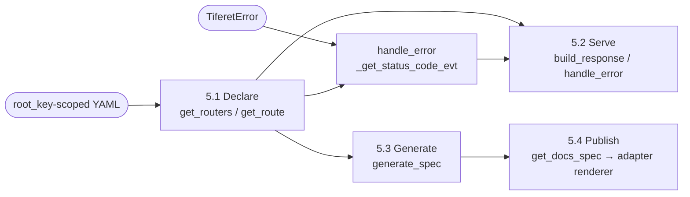

**Status:** Draft · **Domain:** `tiferet-openapi` · **Code:** `tiferet_openapi/` · **Branch:** `v1.x-proto`
**Companion:** `docs/domain-vision.md`

# tiferet-openapi: Core Domain Distillation

## 1. Purpose of this document
The vision statement says what tiferet-openapi is for: describing an API's shape once and deriving everything else — the running service, the published specification, the documentation — from that one declaration. This document says how the domain actually does that today: its vocabulary, its bounded steps, which of those steps already deliver on the vision and which do not yet, and the relationships between the pieces. It is the conceptual reference a later RFP, TRD, or freeze decision should be measured against. Where a technical term is unavoidable, it is defined once in Section 3 and used consistently after that.

## 2. The core domain, restated precisely
tiferet-openapi's core domain is **turning a single declared description of an API's routes, request/response shapes, and error mappings into everything a client and an operator need from that API, without a second, hand-maintained copy of the same facts.**

The domain has one fixed shape, restated precisely from the vision's own pipeline:

> **Declare** (routes, shapes, and error mappings as YAML) → **Serve** (validate a request against the declaration and resolve the right status code) → **Generate** (derive an OpenAPI specification from the same declaration) → **Publish** (hand that specification to a client-facing documentation surface)

and three axes of variation:

1. **Framework adapter** — which web framework (Flask, FastAPI, or a future adapter) is actually receiving HTTP requests and rendering documentation. This domain is deliberately indifferent to this axis at Declare and Generate; it is the reason the Serve and Publish steps exist as named extension points rather than concrete framework code.
2. **YAML `root_key`** — which top-level key in the configuration file holds the declaration (`openapi`, `flask`, or `fast`). This axis is resolved once, at Declare, and is invisible to every later step.
3. **Declared-vs-consumed parity** — whether a field a route declares is actually read by the step that would use it. This is not a designed axis the way the first two are; it is where the domain's own history has left a gap between what `ApiRoute` can say and what `generate_spec` currently does with it (Section 5.3, Section 8). Naming it here, rather than treating it as a footnote, is what makes it possible to scope closing that gap as its own piece of work.

## 3. Ubiquitous language
**`ApiRoute`** — a domain object naming one route: `id`, `endpoint`, `path`, `methods`, `status_code`, and the documentation fields `summary`, `description`, `tags`, `request_model`, and `response_model`.

**`ApiRouter`** — a domain object grouping `ApiRoute` entries under a `name` and an optional URL `prefix`.

**Endpoint** — the fully-qualified, dotted identifier of a route, `router_name.route_id`, used everywhere a route must be named unambiguously (event parameters, `operationId` in the generated spec, request feature IDs).

**`OpenApiService`** — the abstract contract (`get_routers`, `get_route`, `get_status_code`) that any configuration backend must satisfy to supply this domain with routers, a single route, and an error-to-status mapping.

**`OpenApiYamlRepository`** — the sole concrete `OpenApiService` today: a YAML-backed reader parameterized by `root_key` (Section 2, axis 2) so the same code reads a unified `openapi.yml`, or the legacy `flask.yml`/`fast.yml` shapes.

**Domain events** — `GetRouters`, `GetRoute` (parses an endpoint into `router_name`/`route_id` and raises `OPENAPI_ROUTE_NOT_FOUND` if the route does not resolve), and `GetStatusCode`. Each wraps one `OpenApiService` method as an injectable, testable unit.

**Aggregate / TransferObject pair** — this domain's mappers come in two per model. `ApiRouteAggregate`/`ApiRouterAggregate` extend the domain object plus Tiferet's `Aggregate` for in-memory mutation (`add_route`, `remove_route`). `ApiRouteYamlObject`/`ApiRouterYamlObject` extend the domain object plus `TransferObject` for YAML round-tripping, using a `_ROLES` dict to control which fields serialize under which role.

**Model path** — a dotted import string (e.g. `app.domain.request.AddRequest`) stored in `ApiRoute.request_model` or `.response_model`, naming a Pydantic model class without importing it at declaration time. It is resolved only when something asks for its schema (Section 4).

**`OpenApiSessionContext`** — the runtime context that wires the three domain events into the application session hub and implements status-aware response/error handling, `generate_spec`, and `get_docs_spec`. `get_docs_spec` returns generated specification data; it does not render an HTTP documentation page. `create_docs_handler` is retained as a deprecated alias for one release. A framework-specific adapter (outside this repo) owns rendering the returned data as a browsable page. `generate_spec`'s private `_resolve_model_schema` helper raises `TiferetError('OPENAPI_MODEL_RESOLUTION_FAILED', ...)`, carrying the failing `model_path`, when a declared `request_model`/`response_model` path cannot be resolved (Section 4, Section 5.3).

**`OpenApiRequestContext`** — a request context that serializes a `BaseModel`, or a list/dict of them, via `model_dump()` before handing a result back to a caller.

**Base request/response/error models** — `ApiRequestModel` and `ApiResponseModel` are empty `DomainObject` subclasses an application extends to declare a route's actual input/output shape; `ApiErrorResponse` is a concrete model with `error` and `message` fields for documenting failure shapes.

**Generated specification** — the OpenAPI 3.0 document `generate_spec` returns: an `info` block plus a `paths` dict keyed by full URL path and HTTP method, each entry an "operation" object.

## 4. What the domain reads / operates on
The declaration is a YAML file with a `root_key`-scoped `routers` mapping (each entry a router name to prefix and routes) and an `errors` mapping (error code to HTTP status code). This is the only input the Declare step needs, and `OpenApiYamlRepository.get_routers` (`tiferet_openapi/repos/openapi.py:56-78`) reads it in full on every call — there is no partial or incremental read.

Two conventions give this input its leverage:

**The endpoint is the one identifier every later step agrees on.** `ApiRouterYamlObject.map` derives it as `{router_name}.{route_id}` (`tiferet_openapi/mappers/openapi.py:193-200`) at YAML-to-aggregate mapping time, and `GetRoute.execute` (`tiferet_openapi/events/openapi.py:89-95`) parses it back apart to look a route up. A route is never addressed by `id` alone once it has left the router that owns it.

**A model path is data until something resolves it.** `ApiRoute.request_model`/`.response_model` are plain strings (`tiferet_openapi/domain/openapi.py:71-81`); nothing in Declare, Serve, or the route's own validation imports or checks them. The only place that ever turns a model path into a real class is `OpenApiSessionContext._resolve_model_schema` (`tiferet_openapi/contexts/openapi.py:144-175`), via `importlib.import_module` plus `getattr`. It raises `TiferetError('OPENAPI_MODEL_RESOLUTION_FAILED', ...)`, carrying the failing `model_path`, on any resolution failure — a malformed path, a missing module, a missing class, or a class with no `model_json_schema`. A route can declare a `request_model` that has never existed as an importable class, and `generate_spec` now surfaces that loudly instead of silently omitting the field.

## 5. The behaviors

### 5.1 Declaring routers and routes
*Turn the YAML file's `root_key`-scoped data into `ApiRouterAggregate`/`ApiRouteAggregate` instances a service can hand out.*

`OpenApiYamlRepository.get_routers` (`tiferet_openapi/repos/openapi.py:56-78`) loads the `routers` mapping and maps each entry through `ApiRouterYamlObject.model_validate(...).map()`. `get_route` (`tiferet_openapi/repos/openapi.py:80-107`) re-uses `get_routers` and then does a linear search filtered by an optional `router_name`. `get_status_code` (`tiferet_openapi/repos/openapi.py:109-129`) reads the separate `errors` mapping and defaults to `500` for an unmapped code.

**Verdict:** agnostic to which `root_key` is configured — the same code path serves `openapi`, `flask`, and `fast` files identically. Variable only in the value of `root_key` itself, which is a constructor parameter, not a code branch.

### 5.2 Serving a request
*Parse an incoming request, resolve the outgoing status code, and format an error, independent of which framework is driving the call.*

`OpenApiSessionContext` extends the application session hub (`AppSessionContext`) rather than owning request parsing itself; request construction is delegated to the hub's injected `create_request_handler` (Section 3). `build_response` (`tiferet_openapi/contexts/openapi.py:93-115`) extends the hub's own `build_response`, looks the route up by the request's `feature_id` (an endpoint) via the injected `_get_route_evt`, and pairs the response with that route's `status_code`. `handle_error` (`tiferet_openapi/contexts/openapi.py:117-141`) resolves a status code through the injected `_get_status_code_evt` when the exception is a `TiferetError`, defaults to `500` otherwise, and attaches the resolved code to the `TiferetAPIError` the hub's own `handle_error` raises.

**Verdict:** agnostic to the framework-adapter axis as written — nothing here imports Flask or FastAPI. It is variable in practice only in that a framework-specific subclass (living outside this repo, in `tiferet-flask`/`tiferet-fast`) is expected to extend `build_response`/`handle_error`, or supply its own `create_request_handler`, for framework-specific request/response glue; that subclass is a boundary, not a variation this repo's code expresses (Section 9).

### 5.3 Generating a specification
*Derive an OpenAPI 3.0 document from the same declaration Serve already uses.*

On `main` (trunk — not yet reconstructed from this cluster), `generate_spec` still walks every router and route and builds one operation per HTTP method containing only `operationId` and a bare `responses` entry keyed by `status_code`. It does not read `route.summary`, `.description`, `.tags`, `.request_model`, or `.response_model` at all, even though `ApiRoute` has declared all five since v0.1.1/v0.1.2.

On `v1.x-proto`, `OpenApiSessionContext.generate_spec` (`tiferet_openapi/contexts/openapi.py:177-265`) closes this gap: it includes `summary`, `description`, and `tags` on the operation when present, and calls `_resolve_model_schema` (`144-175`) to attach a `requestBody` schema from `request_model` and a response content schema from `response_model`. This landed through TOA1-RFP-002 (issue #27, PR #34) and TOA1-RFP-003's tags round-trip fix (issue #28, PR #32) — reconstructing, under proper RFP process, the same wiring an earlier ad hoc proto commit (PR #22) had introduced without one. `_resolve_model_schema` no longer returns `None` on failure either: TOA1-RFP-004 (issue #29, PR #36) changed it to raise `TiferetError('OPENAPI_MODEL_RESOLUTION_FAILED', ...)`, so `generate_spec` now propagates a broken model reference as a loud failure instead of a silently incomplete spec.

**Verdict:** this was the declared-vs-consumed-parity axis (Section 2, axis 3). It was not a designed variation — the fields and the method that should read them were never in question at the same time; they landed two releases apart. On `v1.x-proto` the gap is now closed and formally governed by RFP (TOA1-RFP-002/003/004); reconstructing the same wiring onto trunk `main` remains a future TRD, per `docs/collab/process.md`'s two-strand model.

### 5.4 Publishing documentation
*Hand the generated specification data to the framework adapter that can make it client-facing.*

`OpenApiSessionContext.get_docs_spec` returns the serializable OpenAPI 3.0 dictionary that `generate_spec` derives from configured routers. It is intentionally framework-agnostic: it returns data rather than an HTTP handler or documentation viewer. `create_docs_handler` delegates to it as a deprecated compatibility alias for one release.

**Verdict:** variable by construction. This domain supplies the generated specification data; each framework adapter owns choosing and serving a browsable documentation renderer (Section 8, Section 9).

## 6. How the behaviors compose
Declare runs once per configuration load; Serve runs once per request; Generate runs on demand (typically once per docs-endpoint hit, not once per request); Publish hands `get_docs_spec`'s data to the adapter's chosen renderer. A parallel error path joins Serve independently of the main pipeline: any `TiferetError` raised during a request is resolved to a status code through the same `OpenApiService` the Declare step populated.

Generate depends on Declare's output but not on Serve having run first; a spec can be generated with no requests ever served. Publish depends on Generate producing a document, but as Section 5.4 shows, nothing currently consumes that dependency.

## 7. Relationships / cross-boundary rules
`OpenApiSessionContext` receives its three domain events by constructor injection (`tiferet_openapi/contexts/openapi.py:41-91`) and only ever calls their `execute` methods through the private `_get_route_evt`/`_get_status_code_evt`/`_get_routers_evt` collaborators — it never talks to an `OpenApiService` directly. `OpenApiYamlRepository` is the only concrete `OpenApiService` in this repo; any relationship between Serve/Generate and a different backing store would have to go through a new implementation of that same contract, not a change to the context.

The Aggregate and TransferObject mappers both inherit directly from the domain object (`ApiRouteAggregate(ApiRoute, Aggregate)`, `ApiRouteYamlObject(ApiRoute, TransferObject)`) rather than wrapping it — a route's fields are declared exactly once, in `domain/openapi.py`, and both mapper families pick them up through Python's own inheritance rather than a second, parallel field list.

Judging whether a `request_model`/`response_model` declaration is *correct* is not something Declare, or the domain object itself, can do — Section 4 already noted the path is inert until `_resolve_model_schema` runs. That makes correctness a property of a specific later call (Generate), not of the declaration in isolation, which is the same shape of problem Section 5.3's entanglement describes from a different angle.

## 8. The agnostic core and the variable edge
**Agnostic — built once, shared regardless of framework or configuration:**
- The YAML-repository pattern itself: one `root_key`-parameterized reader serves every configuration shape this domain currently supports.
- The `ApiRoute`/`ApiRouter` field shape and the endpoint-derivation convention.
- The Aggregate/TransferObject mapping mechanism and its `_ROLES`-based role control.
- The three domain events, as a wrapping mechanism over `OpenApiService`.
- `OpenApiRequestContext`'s `BaseModel`-aware result serialization.

**Variable — one definition per consuming application:**
- The `root_key` value chosen for a given deployment's configuration file.
- Which framework adapter renders the specification returned by `OpenApiSessionContext.get_docs_spec` as a browsable documentation page.
- The actual `ApiRequestModel`/`ApiResponseModel` subclasses an application defines, and the dotted paths that name them.
- The error-code-to-status-code data itself.

**Currently entangled — the honest inventory:**
- **`ApiRoute`'s documentation fields and `generate_spec` still disagree about what exists, on `main`.** `summary`, `description`, `tags`, `request_model`, and `response_model` (`tiferet_openapi/domain/openapi.py:53-81`) have been declarable since v0.1.1/v0.1.2; `generate_spec` on `main` still ignores all five. On `v1.x-proto` this gap is closed (Section 5.3) via TOA1-RFP-002/003, which formally reconstructed the wiring an earlier out-of-process proto commit (PR #22) had introduced directly. Reconstructing that same wiring onto trunk `main` remains outstanding future work, not a defect in the current proto catalog.
- **Publish stops at the framework boundary.** `OpenApiSessionContext.get_docs_spec` provides the generated specification data, while a framework adapter remains responsible for serving it through a browsable documentation page.
- **A mapper defect remains on trunk `main` (already fixed on proto).** `mappers/openapi.py:97` on `main` excludes `'tags'` from the YAML `to_data` role, so a router's tags do not round-trip through a YAML write on trunk today. `v1.x-proto`'s `mappers/openapi.py:97` removes that exclusion, formalized under TOA1-RFP-003 (issue #28, PR #32) with dedicated round-trip test coverage. This was originally bundled with the `generate_spec` fix in ad hoc proto commit PR #22, but is a distinct correctness issue, not a documentation-completeness one, and RFP-003 isolated it as its own artifact.

## 9. Boundaries
**Inside the domain:** declaring routers, routes, and error mappings from a YAML file under a configurable `root_key`; resolving a route by its endpoint; resolving an error code to a status code; generating an OpenAPI 3.0 specification from the declared routers; the base request/response/error Pydantic models an application extends.

**Outside the domain, and who owns it instead:**
- Running an HTTP server and routing an actual incoming request to a handler — owned by the framework adapter (`tiferet-flask`, `tiferet-fast`, or a future one), not this repo.
- Rendering or serving the generated specification as a browsable documentation page — `OpenApiSessionContext.get_docs_spec` supplies data only; the framework adapter chooses and implements the renderer (Section 5.4, Section 8).
- What a route's business logic does once a request reaches it — owned by the feature or workflow the route triggers, not by the route's declaration.
- Validating that request data makes business sense beyond matching its declared shape — owned by the domain logic the route calls into, not by this layer's request/response models.

## 10. Where this leads
1. **Done, on `v1.x-proto`:** TOA1-RFP-002, RFP-003, and RFP-004 (issues #27, #28, #29; PRs #34, #32, #36) reconstructed the `generate_spec`/`_resolve_model_schema` wiring and the `mappers/openapi.py:97` tags round-trip fix under proper RFP process, superseding the direct proto commit (PR #22) that had introduced them out of process. **Still outstanding:** reconstructing this same wiring onto trunk `main` via a reconstruction TRD, once this cluster is frozen.
2. **Implement framework-adapter documentation renderers.** `get_docs_spec` now supplies the framework-agnostic document; each adapter still needs to expose that data through its own browsable documentation page.
3. **Decided and done, on `v1.x-proto`:** TOA1-RFP-004 (issue #29, PR #36) changed `_resolve_model_schema` to raise `TiferetError('OPENAPI_MODEL_RESOLUTION_FAILED', ...)` instead of silently returning `None`, resolving the tension with the vision's promise that documentation cannot quietly drift from the truth.
4. **Answered, by the landed v1 cluster:** the doc-field wiring (items 1 and 3 above) and a working docs handler (item 2) are both included in v1 — TOA1-RFP-001 through RFP-005 (issues #26–#30) landed all of it on `v1.x-proto` under closed milestone `v1.0.0b1`. The open work this document now points to is narrower: reconstructing that same, now-stable catalog onto trunk `main`.
